<p align="center">
  
</p>

<p align="center">
  <strong>Real-time AI sparring partner for high-stakes verbal interactions</strong>
</p>

<p align="center">
  <a href="#scenario-modes">Modes</a> •
  <a href="#architecture">Architecture</a> •
  <a href="#getting-started">Getting Started</a> •
  <a href="#deployment">Deployment</a> •
  <a href="https://glotti.pbartz.net/">Try It Live</a>
</p>

---

## The Idea

Glotti is a real-time AI sparring partner that trains you for pitches, negotiations, debates, and difficult conversations. Unlike passive post-hoc feedback tools, Glotti **interrupts you mid-sentence** with challenges, corrections, and tactical cues — forcing you to adapt under pressure exactly as you would in a real encounter.

The core innovation is leveraging **Gemini Live API's bidirectional audio streaming** to create a sparring partner that *listens* to you in real-time, delivering feedback at the speed of conversation.

### What Makes Glotti Different

- **Real-time interruption** — The agent challenges you *while* you speak, training genuine composure under pressure. Not post-hoc.
- **Configurable personas** — Each scenario mode has its own personality, escalation logic, and evaluation rubric.
- **Live metrics dashboard** — Filler word count, speaking pace, tone confidence, and talk ratio update in real-time on screen.
- **Post-session reports** — Structured breakdowns with timestamps, key moments, scores, and actionable improvement tips.
- **Feedback sessions** — After reviewing your report, rejoin a voice session with the same AI persona to discuss your performance, ask questions, and get targeted advice based on what happened in the original session.
- **Social sharing** — Auto-generated performance cards with OG image previews for sharing results on LinkedIn, X, and more.

---

## Scenario Modes

Glotti ships with multiple AI personas, each with a unique system prompt, interruption strategy, and evaluation criteria.

### PitchPerfect — Startup Founder Sparring
A skeptical venture capitalist who listens to your startup pitch and interrupts with tough investor questions. Tracks filler words, speaking pace, time spent on problem vs. solution, and conviction level.

### EmpathyTrainer — Difficult Conversations Trainer
Adopts the emotional stance of an upset counterparty (customer, employee, parent). Detects your tone — if you sound defensive or dismissive, the agent escalates. Demonstrate empathy and it de-escalates. Tracks empathy score, defensive language ratio, and resolution time.

### Veritalk — Adversarial Debate Sparring
An aggressive debate opponent that uses **Google Search grounding** to pull real-time counter-arguments and fact-checks. Forces you to think on your feet. Tracks argument coherence, recovery time after interruption, and logical fallacy count.

### Impromptu — Spontaneous Speaking
Practice building structure on the fly with surprise topics. Evaluated on clarity, structure (open → develop → close), confidence markers, and filler word discipline.

---

## Architecture

### High-Level Overview

```mermaid
graph TB
    subgraph User["👤 User"]
        Browser["Browser<br/>(React SPA)"]
    end

    subgraph Backend["☁️ Cloud Run"]
        Server["Node.js Server<br/>(Express + WebSocket)"]
    end

    subgraph Google["🔷 Google Cloud & AI"]
        Gemini["Gemini 2.5 Flash<br/>(Live API)"]
        Firestore["Firestore<br/>(Session Storage)"]
        Search["Google Search<br/>(Grounding)"]
    end

    Browser -- "WebSocket<br/>(audio + events)" --> Server
    Server -- "WebSocket<br/>(audio responses + metrics)" --> Browser
    Server -- "WebSocket<br/>(streaming audio)" --> Gemini
    Gemini -- "WebSocket<br/>(voice + transcriptions)" --> Server
    Server -- "REST<br/>(read/write sessions)" --> Firestore
    Gemini -. "Grounding queries<br/>(Veritalk mode)" .-> Search
```



### Key Technical Decisions

| Decision | Rationale |
|---|---|
| **WebSocket proxy pattern** | The backend sits between browser and Gemini Live API — pipes audio bidirectionally while simultaneously extracting metrics and managing session state. This enables server-side analytics without adding client latency. |
| **Gemini Live API** | Bidirectional audio streaming with barge-in support. The agent can interrupt the user mid-sentence and the user can interrupt the agent — enabling natural, pressure-testing conversation flow. |
| **Google ADK (limited)** | ADK `LlmAgent` + `Runner.runAsync()` for post-session report generation; `InMemoryRunner.runEphemeral()` for real-time tone analysis and analytics. Live audio streaming remains on raw `@google/genai` — ADK's `Runner.runLive()` is not yet implemented in the TypeScript SDK. |
| **Google Cloud native** | Cloud Run for containerized hosting (scales to zero), Firestore for session persistence, Secret Manager for API keys. Single `npm run deploy` command. |
| **Persona-as-prompt** | Each scenario is defined by a markdown system prompt in `server/agents/prompts/`. Adding a new mode requires only writing a prompt file and registering it in config — no code changes to the core engine. |
| **Server-side OG image generation** | Social share previews use Satori + Resvg to render React components to PNG on the server, ensuring rich link previews on LinkedIn, X, Slack, and Discord. |
| **Multi-stage Docker build** | Production image uses a two-stage Dockerfile — build stage compiles TypeScript, runtime stage copies only compiled output and production deps for a minimal container. |

> **📐 Detailed architecture diagrams** — See [docs/diagrams.md](docs/diagrams.md) for 8 Mermaid diagrams covering the system at every level: high-level overview, WebSocket protocol, backend modules, audio pipeline, ADK agents, React components, deployment, and session lifecycle state machine.

### Tech Stack

**Client:**
- React 19 + TypeScript
- Vite (dev server + production build)
- Web Audio API / AudioWorklet (mic capture & playback)
- Native WebSocket API (custom `useWebSocket` hook)
- Lucide React (icons)
- html-to-image (performance card generation)

**Server:**
- Node.js + Express 5 + TypeScript
- `ws` library (raw WebSocket control for binary audio streaming)
- `@google/genai` SDK (Gemini Live API — bidirectional audio streaming)
- `@google/adk` SDK (report generation, tone analysis, analytics — non-streaming only)
- Zod (runtime validation)
- Satori + Resvg (server-side OG image rendering)

**Google Cloud:**
- **Cloud Run** — Containerized backend, scales to zero
- **Firestore** — Session persistence, transcripts, reports
- **Secret Manager** — API key storage
- **Cloud Build + Artifact Registry** — CI/CD pipeline

---

## Getting Started

### Prerequisites
- Node.js 22+
- A [Gemini API key](https://aistudio.google.com/apikey)

### Installation

```bash
# Clone the repository
git clone https://github.com/ilyaev/glotti.git
cd glotti

# Install dependencies
npm install
cd client && npm install && cd ..

# Configure environment
cp .env.example .env
# Add your GEMINI_API_KEY to .env
```

### Development

```bash
# Start both server and client in dev mode
npm run dev
```

This runs:
- **Server** on `http://localhost:8080` (with hot reload via `tsx watch`)
- **Client** on `http://localhost:5173` (with Vite HMR)

### Production Build

```bash
npm run build        # Builds server (tsc) + client (vite)
npm start            # Starts the production server
```

---

## Deployment

Glotti is designed to run on **Google Cloud Run** as a single containerized service. Deployment is fully automated via infrastructure-as-code scripts included in the repository.

### One-Command Deploy

The [`deploy.sh`](deploy.sh) script handles the entire setup — enabling GCP APIs, creating Firestore, storing the API key in Secret Manager, and deploying to Cloud Run:

```bash
./deploy.sh                          # Uses current gcloud project
./deploy.sh --project my-project-id  # Specify a project
./deploy.sh --region europe-west1    # Override region
./deploy.sh --service my-service     # Override service name (default: debatepro-backend)
```

### CI/CD Pipeline

The [`cloudbuild.yaml`](cloudbuild.yaml) defines a Cloud Build pipeline that builds the Docker image, pushes it to Artifact Registry, and deploys to Cloud Run. It can be triggered automatically on push or run manually:

```bash
gcloud builds submit --config cloudbuild.yaml .
```

### Infrastructure-as-Code Files

| File | Purpose |
|---|---|
| [`deploy.sh`](deploy.sh) | Full automated deployment script (APIs, Firestore, secrets, Cloud Run) |
| [`cloudbuild.yaml`](cloudbuild.yaml) | Cloud Build CI/CD pipeline definition |
| [`Dockerfile`](Dockerfile) | Multi-stage container build (TypeScript compile → minimal runtime image) |

See [specs/deployment.md](specs/deployment.md) for detailed manual steps and alternative frontend hosting options.

---

## Project Structure

```
├── server/                  # Node.js backend
│   ├── main.ts              # Express + WebSocket server entry
│   ├── ws-handler.ts        # WebSocket orchestrator (~120 LOC)
│   ├── session/             # Modular session logic
│   │   ├── state.ts         # Session state factory
│   │   ├── gemini-bridge.ts # Gemini Live API connection
│   │   ├── protocol.ts      # Client ↔ Server message protocol
│   │   ├── metrics.ts       # Speech metrics (filler words, WPM)
│   │   ├── transcript-buffer.ts
│   │   ├── tone-analyzer.ts # Background LLM tone analysis
│   │   └── constants.ts     # Tunable thresholds
│   ├── adk/                 # Google ADK integration (non-streaming)
│   │   ├── agents.ts        # LlmAgent definitions (report agent)
│   │   ├── runner.ts        # Runner factory + runReportAgent()
│   │   └── index.ts         # Barrel exports
│   ├── agents/prompts/      # Persona system prompts (markdown)
│   ├── api/                 # REST endpoints
│   └── services/            # OG image rendering
├── client/                  # React frontend
│   └── src/
│       ├── components/      # UI components (Dashboard, Session, Report, etc.)
│       ├── hooks/           # Custom hooks (useAudio, useWebSocket, useSessionLogic)
│       └── utils/           # Shared utilities
├── specs/                   # Technical specifications
├── docs/                    # Product documentation
└── Dockerfile               # Multi-stage production build
```

---

## Adding a New Mode

1. **Write a system prompt** — Create a markdown file in `server/agents/prompts/`
2. **Register the mode** — Add it to the `MODES` object in `server/config.ts`
3. **Update client types** — Add the mode ID to the `Mode` type
4. **Add a UI card** — Add the mode entry to `ModeSelect.tsx` with icon and description

No changes to the WebSocket handler or session engine are needed — the persona-as-prompt architecture keeps mode additions purely declarative.

Or just ask your AI coding agent:

> Check `specs/persona.md` for instructions and add a new persona which is a ruthless negotiation opponent for salary and contract discussions

---

## License

MIT
