# Glotti — Architecture Diagrams

This document provides visual architecture diagrams at different levels of scope and detail, illustrating how the system components connect — from a high-level cloud overview down to individual module interactions.

---

## 1. High-Level System Overview

**Scope:** Bird's-eye view of the entire system. Shows the three main pillars (Browser, Backend, Google Cloud services) and the primary communication channels between them.

**Audience:** Non-technical stakeholders, contest judges, new team members.

```mermaid
graph TB
    subgraph User["👤 User"]
        Browser["Browser<br/>(React SPA)"]
    end

    subgraph Backend["☁️ Cloud Run"]
        Server["Node.js Server<br/>(Express + WebSocket)"]
    end

    subgraph Google["🔷 Google Cloud & AI"]
        Gemini["Gemini 2.5 Flash<br/>(Live API)"]
        Firestore["Firestore<br/>(Session Storage)"]
        Search["Google Search<br/>(Grounding)"]
    end

    Browser -- "WebSocket<br/>(audio + events)" --> Server
    Server -- "WebSocket<br/>(audio responses + metrics)" --> Browser
    Server -- "WebSocket<br/>(streaming audio)" --> Gemini
    Gemini -- "WebSocket<br/>(voice + transcriptions)" --> Server
    Server -- "REST<br/>(read/write sessions)" --> Firestore
    Gemini -. "Grounding queries<br/>(Veritalk mode)" .-> Search
```

**Key takeaways:**
- The backend acts as a **proxy** between the browser and Gemini Live API — it never exposes the Gemini API key to the client.
- All real-time communication uses **WebSockets** for low-latency bidirectional audio streaming.
- Firestore is used for **persistence** only (session records, reports). All live state is in-memory on the server.
- Google Search grounding is used only in Veritalk (debate) mode for real-time fact-checking.

---

## 2. Client-Server Communication Architecture

**Scope:** Zooms into the WebSocket protocol and REST API layer. Shows what data flows between browser and server, and the message types exchanged.

**Audience:** Frontend/backend developers, integration testers.

**Key takeaways:**
- Binary messages carry raw audio; JSON messages carry commands, transcripts, and metrics.
- The server **buffers** transcript fragments and flushes them on sentence boundaries (10-word threshold for user, 15 for AI).
- Barge-in is a first-class protocol feature — Gemini detects user speech over AI output and signals interruption.
- Report generation happens server-side after session close, using ADK `Runner.runAsync()`.

---

## 3. Backend Internal Architecture

**Scope:** Detailed view of the server-side module structure. Shows how the WebSocket handler orchestrates session modules, agents, and services.

**Audience:** Backend developers, code reviewers, architects.

**Key takeaways:**
- `ws-handler.ts` is a **slim orchestrator** (~120 LOC) that delegates to focused modules.
- Dependency injection: `main.ts` creates the shared `SessionStore` and injects it into both the WS handler and REST router.
- The ADK layer is used for report generation (`Runner.runAsync`) and analytics (`InMemoryRunner`). Live audio streaming uses raw `genai.live.connect()` directly because ADK's `runLive()` is not yet available in the TypeScript SDK.
- All tunable thresholds (flush intervals, filler word lists, cooldown timers) are centralized in `constants.ts`.

---

## 4. Real-time Data Flow — Audio + Metrics Pipeline

**Scope:** Traces the journey of a single user utterance from microphone capture to dashboard metric update. Shows audio, transcript, and metric pipelines running in parallel.

**Audience:** Engineers debugging latency, audio issues, or metric accuracy.

```mermaid
flowchart LR
    subgraph Client["Browser"]
        Mic["🎤 Microphone<br/>Web Audio API"]
        Playback["🔊 Speaker<br/>Audio Playback"]
        Dashboard["📊 Dashboard<br/>Live Metrics"]
        Transcript["📝 Transcript<br/>Feed"]
    end

    subgraph Server["Node.js Backend"]
        WS["WebSocket<br/>Handler"]
        TB["Transcript<br/>Buffer"]
        ME["Metrics<br/>Extractor"]
        TA["Tone<br/>Analyzer"]
    end

    subgraph Gemini["Gemini Live API"]
        ASR["Speech-to-Text<br/>(built-in)"]
        LLM["LLM<br/>(coaching logic)"]
        TTS["Text-to-Speech<br/>(built-in)"]
    end

    Mic -- "PCM 16kHz" --> WS
    WS -- "forward audio" --> ASR
    ASR -- "inputTranscription" --> TB
    ASR --> LLM
    LLM --> TTS
    TTS -- "PCM 24kHz" --> WS
    WS -- "audio chunk" --> Playback
    TB -- "flushed sentence" --> ME
    TB -- "transcript_cue" --> Transcript
    ME -- "MetricSnapshot" --> Dashboard
    TA -- "tone + hint<br/>(every 15s)" --> Dashboard

    style Mic fill:#e1f5fe
    style Playback fill:#e1f5fe
    style Dashboard fill:#fff3e0
    style Transcript fill:#f3e5f5
```

**Key takeaways:**
- Audio flows as raw PCM binary — no encoding/decoding overhead.
- Input is 16kHz (mic quality); output is 24kHz (higher fidelity voice).
- Metrics are computed **synchronously** on each sentence flush — zero additional LLM latency for filler words, WPM, clarity.
- Tone analysis runs **asynchronously** in the background every 15 seconds via a separate Gemini Flash call.

---

## 5. ADK Multi-Agent Architecture

**Scope:** Shows how Google's Agent Development Kit (ADK) is used for different tasks — report generation, tone analysis, and analytics — and the relationship between agents, runners, and the Gemini API.

**Audience:** AI/ML engineers, ADK integration developers.

**Key takeaways:**
- **Live audio streaming** uses the raw `@google/genai` SDK (`genai.live.connect()`) because ADK's `Runner.runLive()` is not yet available in the TypeScript SDK (v0.4.0).
- **Report generation** uses ADK's `Runner.runAsync()` with `InMemorySessionService` for structured output.
- **Analytics** uses `InMemoryRunner` for stateless, one-shot transcript analysis.
- **Tone analysis** uses a direct Gemini Flash call (not ADK) for lightweight periodic checks.
- Each coaching mode has its own system prompt file and report evaluation config.

---

## 6. Client Component Architecture

**Scope:** React component tree and hook composition. Shows how UI components are organized and which hooks manage state and side effects.

**Audience:** Frontend developers, UX engineers.

**Key takeaways:**
- The app uses **hash-based routing** (`#/sessions`, `#/sessions/:id/:key`) — no server-side routing needed.
- `Session.tsx` is a slim orchestrator (~50 LOC) that composes sub-components and hooks.
- `useSessionLogic` is the core hook — it composes `useWebSocket` + `useAudio` and manages the full session state machine (status, metrics, transcript, timer).
- Reports are **mode-specific** — each mode has its own report component with tailored categories and visualizations.
- Share functionality is decomposed into reusable hooks (`useShareUrls`, `useClipboard`) and sub-components.

---

## 7. Deployment Architecture

**Scope:** Production deployment on Google Cloud. Shows container build pipeline, Cloud Run configuration, and how services are connected in production vs. development.

**Audience:** DevOps engineers, deployment reviewers.

**Cloud Run Configuration:**
| Setting | Value | Reason |
|---|---|---|
| Concurrency | 1 | Each WebSocket session is long-lived and stateful |
| Min instances | 0 | Scale to zero when idle (cost saving) |
| Max instances | 10 | Contest demo scale |
| Timeout | 3600s | Support long WebSocket sessions |
| Port | 8080 | Standard Cloud Run port |

**Key takeaways:**
- In **development**, Vite proxies API/WS requests to Express — no CORS issues, full HMR.
- In **production**, Express serves the Vite-built static files directly — single container, single port.
- The Gemini Live API connection is **identical** in both environments — same remote WebSocket endpoint.
- Firestore is only used in production; local dev uses a JSON file-based store that survives server restarts.
- API keys flow through `.env` locally and Secret Manager in production — never committed to git.

---

## 8. Session Lifecycle State Machine

**Scope:** The complete lifecycle of a coaching session, from mode selection to report delivery, showing state transitions and the events that trigger them.

**Audience:** Full-stack developers, QA engineers.

```mermaid
stateDiagram-v2
    [*] --> ModeSelect: User opens app

    ModeSelect --> Connecting: User clicks "Start Session"
    Connecting --> SetupComplete: Gemini Live connected
    SetupComplete --> Listening: AI sends greeting

    state "Active Session" as Active {
        Listening --> AIResponding: User speaks
        AIResponding --> Listening: AI finishes turn
        AIResponding --> Interrupted: User barge-in
        Interrupted --> Listening: Ready for next input
    }

    Active --> Ending: User clicks "End Session"
    Active --> Ending: Session timeout
    Active --> AIDisconnected: Gemini connection drops

    AIDisconnected --> Ending: User clicks "End Session"

    Ending --> GeneratingReport: Gemini session closed
    GeneratingReport --> ReportReady: ADK Runner.runAsync() completes
    ReportReady --> SessionSaved: Saved to Firestore/FileStore
    SessionSaved --> [*]: Report displayed to user

    note right of Active
        During active session:
        • Metrics updated on every sentence flush
        • Tone analyzed every 15 seconds
        • Transcript streamed to UI
    end note
```

**Key takeaways:**
- The session is **event-driven** — state transitions are triggered by WebSocket messages from Gemini or user actions.
- **Barge-in** (user interrupting the AI) is a distinct state transition that triggers `interrupted` → client stops audio playback.
- Report generation is **synchronous-blocking** after session end — the user sees a loading overlay while it completes.
- If the Gemini connection drops unexpectedly, the client is notified but the session doesn't auto-end — the user decides when to close.
